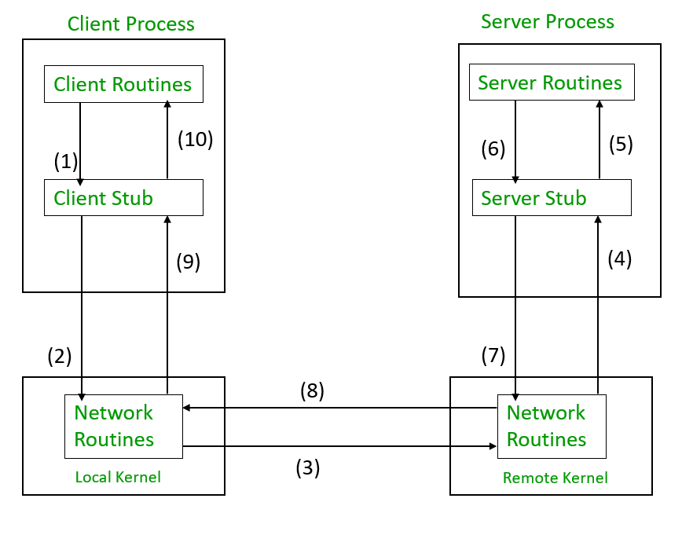

# RPC(Remote Procedure Calls)

RPC stands for Remote Procedure Call, which is a technique for making a call to a function or method that resides on a remote server as if it were a local function call. It is a mechanism for communicating with a server and requesting it to execute a specific method, with the results of the method execution returned to the client.

## Elements of RPC Mechanism:
1. **Client** : Client is a user process that initiates a remote call of a procedure (or a method or a function).In other words, it is the program or application that makes the request to a remote server.  

2. **Client Stub**: Client stub is a code module that resides on client side and acts as a proxy for remote procedures. It marshals the arguments of the procedure call into a format that can be transmitted over the network to the server.  

3. **RPC Runtime**: The RPC runtime is a software layer that manages the communication between the client and the server. It provides the infrastructure for handling remote procedure calls, including message serialization and deserialization, transport protocol management, and error handling.  

4. **Server Stub**: The server stub is a code module that resides on the server side and receives the request from the client stub. It unmarshals the arguments, calls the actual procedure, and marshals the return value into a format that can be transmitted back to the client.  

5. **Server**: The server is the program or application that receives the remote procedure call and executes the requested procedure. It processes the request, generates the response, and sends it back to the client.  

## How does RPC work?
RPC works by defining a contract between the client and server, specifying the methods that can be called on the server, and then the parameters and return values of those methods. The client then invokes the remote method by sending a message to the server over network. This message includes the name of the method to be invoked, along with any parameters that need to be passed to the method in doing so.  
RPC (Remote Procedure Call) is a technique that enables a client program to call a remote server program as if it were a local procedure.  
The process of making a remote procedure call involves the following steps:

  

Below entire process happens behind the scenes, and the client program doesn’t need to worry about the network details or the low-level implementation details of the remote procedure. The RPC system takes care of all of these details, making it much easier for developers to build distributed systems. It is as follows: 

1. The client procedure initiates the remote procedure call by calling the client stub in the normal way.
2. The client stub builds a message that contains the procedure name and its parameters and then calls the local operating system (OS).
3. The client’s OS sends the message over the network to the remote OS.
4. The remote OS receives the message and passes it to the server stub.
5. The server stub unpacks the parameters from the message and then calls the actual server procedure.
6. The server processes the request and returns the result to the server stub.
7. The server stub packs the result into a message and then calls the local OS.
8. The server’s OS sends the message over the network to the client’s OS.
9. The client’s OS receives the message and then gives it to the client stub.
10. The client stub unpacks the result from the message and then returns it to the client procedure.

**RPC implementations can use various protocols to transmit data between the client and server, including HTTP, TCP, and UDP. The choice of protocol depends on the specific needs of the application, such as the use case, the level of reliability, and the speed required**.

**RPC calls can be synchronous or asynchronous. In a synchronous call, the client waits for the server to process the request and return the response before proceeding with further operations. In an asynchronous call, the client sends the request to the server and continues with other operations, without waiting for the server to respond. The server sends the response back to the client when it is ready**.

**Example**: Financial Transactions: Suppose you are building a financial application that needs to execute transactions on a remote server. You might implement an RPC-based interface that allows the client to invoke a “transfer_funds” method on the server, passing in the amount to be transferred and the account details of the sender and recipient.

# GRPC 
The “g” in gRPC stands for “Google”. gRPC is an open-source remote procedure call (RPC) framework originally developed by Google for internal use and later released as open source. gRPC is designed to be high-performance, scalable, and easy to use, and it supports multiple programming languages and platforms. It uses the HTTP/2 protocol for transport and Protocol Buffers for serialization, and it offers several features not found in traditional RPC systems, such as bi-directional streaming and server-side streaming. Since its release, gRPC has become popular with many companies and organizations for developing high-performance and scalable distributed systems.

However, there are some differences between them:

- RPC is a generic protocol for remote procedure calls, while gRPC is a specific implementation of RPC that uses the HTTP/2 protocol for communication.
- Also, RPC uses a binary encoding format to transmit data, while gRPC supports several serialization formats, including Protocol Buffers, JSON, and XML.
- RPC is widely supported on various platforms and programming languages, while gRPC has better support for modern programming languages like Go, Python, and Java.
- gRPC is generally faster and more efficient than RPC, due to its use of HTTP/2 and the binary serialization format.
- Last but not least, gRPC has some additional features that are not available in traditional RPC, such as bi-directional streaming and server-side streaming.